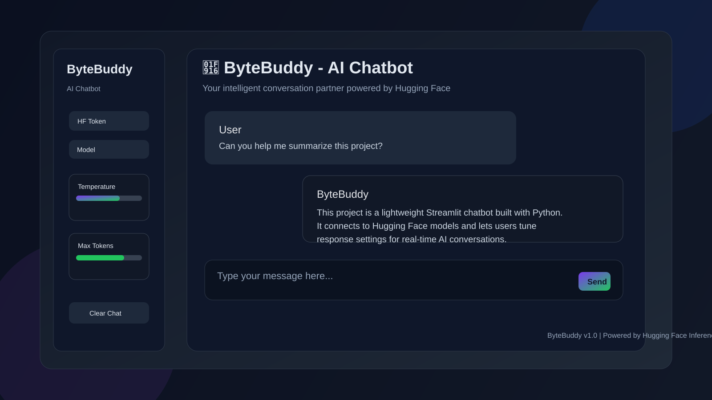
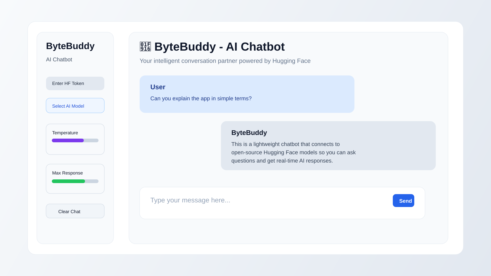
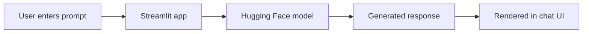

# ByteBuddy 🤖

<div align="center">
  
</div>

<p align="center">
  
  
  
  
</p>

ByteBuddy is a modern AI chatbot interface built with Python and Streamlit. It lets users chat with open-source large language models hosted on Hugging Face, adjust generation settings in real time, and keep a clean conversational experience without writing any frontend code.

## Why ByteBuddy?

- Conversational UI built with Streamlit
- Model switching for experimentation
- Token-based Hugging Face integration
- Adjustable creativity and response length controls
- Minimal setup and easy local deployment

## UI Preview

<div align="center">
  
</div>

## Features

- 💬 Real-time chat interface with message history
- 🤖 Model selection from several open-source HF models
- ⚙️ Adjustable temperature, top-p, and max output length
- 🔐 Secure local token input through the sidebar
- 📊 Lightweight, responsive, and easy to run locally
- 🧠 Suitable for experimentation with LLM prompts and settings

## Tech Stack

- Python 3.10+
- Streamlit
- Hugging Face InferenceClient
- python-dotenv

## Project Structure

```text
ByteBuddy/
├── app.py                 # Main Streamlit application
├── config.py              # Configuration values and model list
├── utils.py               # Helper logic and utility functions
├── requirements.txt       # Python dependencies
├── .env.example           # Example environment file
├── README.md              # Project documentation
├── docs/
│   └── screenshots/
│       ├── bytebuddy-dashboard.svg
│       └── bytebuddy-chat.svg
└── .gitignore
```

## Quick Start

### 1. Clone the repo

```bash
git clone https://github.com/sgsinghashka-del/ByteBuddy.git
cd ByteBuddy
```

### 2. Create a virtual environment

```bash
python -m venv .venv
source .venv/bin/activate    # Linux/macOS
.venv\Scripts\activate       # Windows
```

### 3. Install dependencies

```bash
pip install -r requirements.txt
```

### 4. Add your Hugging Face token

Create a `.env` file in the project root:

```env
HF_TOKEN=your_huggingface_token_here
```

You can also copy from `.env.example`:

```bash
cp .env.example .env
```

### 5. Run the app

```bash
streamlit run app.py
```

Then open the local Streamlit URL in your browser.

## Usage

1. Enter your Hugging Face token in the sidebar.
2. Choose a model from the available options.
3. Adjust temperature, top-p, and token count if needed.
4. Start chatting with the AI assistant.
5. Use the clear chat button to reset the conversation history.

## Supported Models

The app includes several open-source Hugging Face models:

- Mistral-7B-Instruct-v0.2
- Llama-2-7b-chat-hf
- Zephyr-7b-beta
- Falcon-7b-instruct

## Environment Variables

| Variable | Description |
| --- | --- |
| `HF_TOKEN` | Hugging Face token used to access the inference API |

## Notes

- This project relies on the Hugging Face Inference API and requires a valid token.
- If the token is invalid or rate-limited, the app displays clear error messages.
- The repository is intentionally lightweight and beginner-friendly for experimentation.

## License

This project is open source and can be used for learning, prototyping, and experimentation.

## Screenshots

The following previews are included in the repository for a quick visual idea of the app:

- Dashboard overview: `docs/screenshots/bytebuddy-dashboard.svg`
- Chat experience: `docs/screenshots/bytebuddy-chat.svg`

These graphics can be replaced with real app screenshots once the project is running locally and captured in a browser.

## Demo Flow



## Contributing

Pull requests and improvements are welcome. For a clean start:

```bash
git checkout -b feature/my-improvement
```

Then make your changes and submit a PR.

---

<p align="center">
  <b>Built with ❤️ using Python, Streamlit, and Hugging Face</b>
</p>
